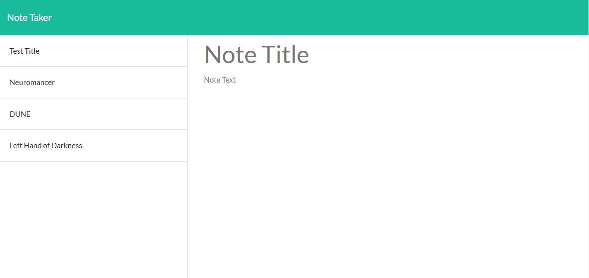
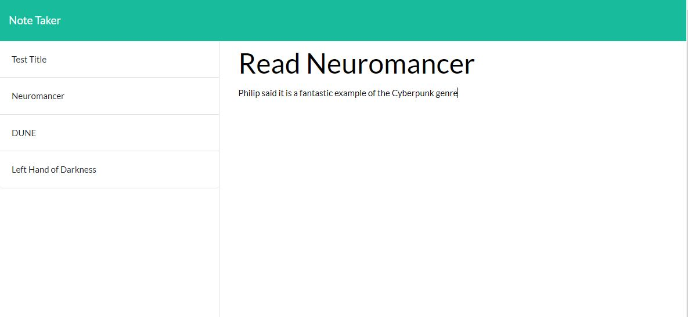

# Week 11 - Express Note Taker

## Description

```
Application that can be used to write, save and delete notes.
```


## Mock-Up

The following images show the web application's appearance and functionality. Press the + to create a new note. Press the save icon to save the note to the list. Press the trash can icon to delete a note:






## Link

Link for deployed Heroku site:
https://express-note-taker-schreiber.herokuapp.com/

- - -
© 2022 Trilogy Education Services, LLC, a 2U, Inc. brand. Confidential and Proprietary. All Rights Reserved.
